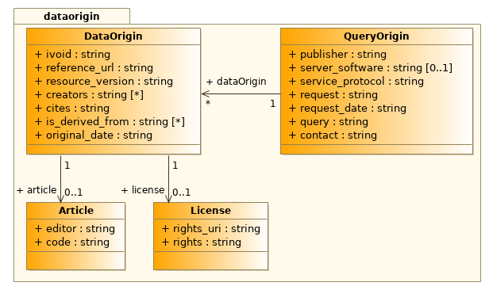
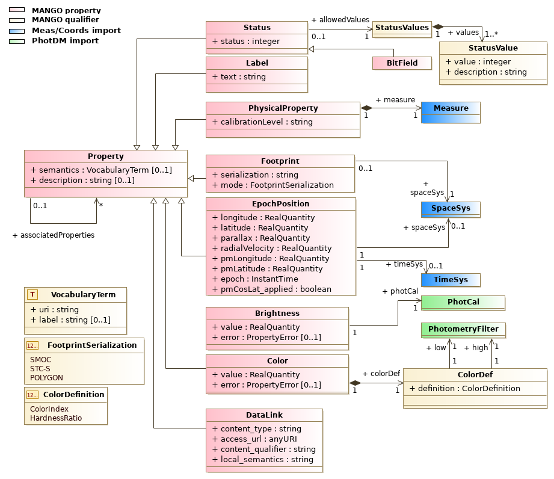

.. _mivot-annoter:

******************************************************
MIVOT (``pyvo.mivot``): Annotation Writer - Public API
******************************************************

This API allows to easily map VOTable data to the Mango data model (both native and imported components).
Only a little knowledge of the models is required.

Mango is a model designed to enhance the description of table data in a way that each table
row can be interpreted as a Mango Object.
Mango objects are made of a property container, a description of the data origin and links
on other Mango objects (not implemented yet).

In this current implementation, only 3 properties are supported (Epoch position, photometry, and color)
in addition to the data origin that can be added as literal values (not connected with table data).

The pseudo codes below show the way to use this API.

The first step is to create the Annotation Builder and connect it to the VOTable to be annotated.

 .. code-block:: python

    votable = parse("MY/VOTABLE")
    builder = InstancesFromModels(votable, dmid="DR3Name")

The ``dmid`` optional parameter gives the column (ID or name) to be used as identifier of the Mango objects.

The builder is then ready to get the properties to add to the Mango object.

 .. code-block:: python

     builder.add_mango_magnitude(photcal_id=photcal_id, mapping=mapping, semantics=semantics)
     builder.add_mango_magnitude(photcal_id=other_photcal_id, mapping=other_mapping, semantics=other_semantics)
     builder.add_mango_color(filter_ids=filter_ids, mapping=mapping, semantics=semantics)
     builder.add_mango_epoch_position(frames=frames, mapping=mapping, semantics=semantics)

We can now add the description of the data origin.

 .. code-block:: python

     builder.add_query_origin(mapping)

- The order in which the components are added does not matter.
- The details of the parameters are described below.

Now the MIVOT block can be completed and inserted into the VOtable.

 .. code-block:: python

    builder.pack_into_votable()
    votable.to_xml("MY/ANNOTATED/VOTABLE")

About Parameters
================

Mappings are always given as dictionaries, where keys are the model roles and values
are either column names or literal values.

The lists of supported roles are given in the :py:mod:`pyvo.mivot.glossary`.

The 3 functions adding properties have all 3 arguments

- ``filter/frame``: Map of the coordinate systems or photometric calibrations that apply to the property.
  All values specified here are considered literal.
  The corresponding Mivot instances are placed in the GLOBALS block.

  - **Photometric filter**: must be given as a filter profile service identifier (filter id followed with the photometric system)

    - Identifiers can be found on  the SVO `page <http://svo2.cab.inta-csic.es/theory/fps/>`_
      (example: ``GAIA/GAIA3.Grp/AB``)
    - The FPS service returns a full calibration instance, which is then split into a filter object
      and a calibration object that refers to that filter.
    - Each one of these components has its own ``dmid`` generated by the API. ``dmid`` can be used to reference them.
      Example for filter ``GAIA/GAIA3.Grp/AB``:

      - photometric calibration identifer: ``dmid="_photcal_GAIA_GAIA3_Grvs_AB"``
      - filter identifier ``dmid="_filter_GAIA_GAIA3_Grvs_AB"``

  - **Coordinate systems**: Can be given either by ``dmid`` or by parameters
    (see `pyvo.mivot.writer.InstancesFromModels.add_simple_space_frame`
    and `pyvo.mivot.writer.InstancesFromModels.add_simple_time_frame`).

    - by ``dmid``: Identifiers are generated by the API when a frame is added in the GLOBALS.
      (example ``{"dmid": "_spaceframe_spaceRefFrame_equinox_refPosition"}``)
    - by parameters: The mapping parameters are given as dictionaries as for the mapping  (see below)
      (example ``{"spaceRefFrame": "ICRS", "refPosition": 'BARYCENTER'}``)

- ``Mapping``: Mapping of the table data to the property attributes.
  The fine structure of these dictionaries is specific to each mapped class,
  but all follow the same pattern.
  Values specified as strings are considered to be column identifiers,
  unless the string starts with a '*'. In this case, the stripped string is taken as the literal value.
  Other value types (numeric or boolean) are all considered as literals.

  +-------------+---------------------------------+
  | **value**   | **attribute value**             |
  +=============+=================================+
  | "\*M31"     | "M31"                           |
  +-------------+---------------------------------+
  | "ObjName"   | value of the column "ObjName"   |
  +-------------+---------------------------------+
  | True        | True                            |
  +-------------+---------------------------------+
  | 123456      | 123456                          |
  +-------------+---------------------------------+
  | 45.8987     | 45.8987                         |
  +-------------+---------------------------------+

- ``semantics``: Semantic tags (text + vocabulary entry) that apply to the property.

  +-------------+---------------------------------------------------------+
  + **key**     | **value**                                               +
  +=============+=========================================================+
  + description + free text description of the property                   +
  +-------------+---------------------------------------------------------+
  + uri         + URI of the vocabulary term to which the property refers +
  +-------------+---------------------------------------------------------+
  + label       + vocabulary term to which the property refers            +
  +-------------+---------------------------------------------------------+

  All ``semantics`` fields are considered literal values.

Add Query origin
----------------

Add the Mango ``QueryOrigin`` instance to the current ``MangoObject``.

   DataOrigin package of Mango.

``QueryOrigin`` is the object grouping together all the components needed to model the origin
of the MangoObject. It is always identified with ``dmid="_origin"``

.. code-block:: python

    builder.add_query_origin(mapping)

The detail of the ``mapping`` parameter is given in the `pyvo.mivot.writer.InstancesFromModels.add_query_origin` documentation

The ``QueryOrigin`` object can be automatically built from the INFO tags of the VOtable. The success of this operation depends
on the way INFO tags are populated.

The method below, analyzes the INFO tags and insert the resulting query origin into the annotations.

.. code-block:: python

    builder.extract_data_origin()

- This code has been optimized to work with Vizier output.
- INFO tags of the VOTable header are analysed to set the ``QueryOrigin`` attributes.
- INFO tags of the header of the first resource are analyzed to set the ``DataOrigin`` objects.
- The automatic mapping does not work for VOtable joining several tables yet.

Add Properties
--------------

The main purpose of the ``MangoObject`` is to collect various properties contained in the data row,
although synthetic properties (literal value only) can be added as well.

- The properties are stored in a container named ``propertyDock``.
- During he annotation process, properties are added one by one by specific methods.

   Properties supported by Mango.

Add EpochPosition
^^^^^^^^^^^^^^^^^

The ``EpochPosition`` property describes the astrometry of a moving source.

.. figure:: _images/mangoEpochPosition.png
   :width: 500

   EpochPosition components of Mango.

It handles six parameters (position, proper motion, parallax and radial velocity) valid at a given epoch
(``obsDate`` field) with their correlations and errors and the coordinate system for both space and time axis.

.. code-block:: python

    builder.add_epoch_position(frames, mapping, semantics)

The detail of the parameters is given with the description of the
:py:meth:`pyvo.mivot.writer.InstancesFromModels.add_mango_epoch_position` method.

The first parameter (``frames``) specifies both space and time frames.
It can either contain the frame dmid-s if they are already installed, for instance from TIMESYS and COOSYS tags,
or the mapping elements needed to install them:

Both frames can be automatically extracted from the COOSYS and TIMSYS VOTable elements.
.. code-block:: python

    frame_mapping = builder.extract_frames()
    builder.add_epoch_position(frame_mapping, mapping, semantics)

This automatic metedata extraction can be extended to any method parameters.

- COOSYS -> coords:SpaceSys
- TIMESYS -> coords:TimeSys
- FIELD -> mango:EpochPosition

.. code-block:: python

    epoch_position_mapping = builder.extract_epoch_position_parameters()
    builder.add_mango_epoch_position(**epoch_position_mapping)

However, it is advisable to take a look at the automatic mapping, as its content
is highly dependent on the VO table metadata, and the risk of incompleteness,
mismatches or confusion cannot be ruled out.

Add Brightness
^^^^^^^^^^^^^^

The ``Brightness`` binds a flux or a magnitude with an error and a photometric calibration.

.. code-block:: python

    builder.add_mango_brightness(photcal_id, mapping, semantics)

The detail of the parameters is given with the
:py:meth:`pyvo.mivot.writer.InstancesFromModels.add_mango_brightness` docstring.

Add Color
^^^^^^^^^

The ``Color`` binds to a Color index or an hardness ratio value with an error and two photometric filters.

.. code-block:: python

    builder.add_mango_color(filter_ids, mapping, semantics)

The detail of the parameters is given with the
:py:meth:`pyvo.mivot.writer.InstancesFromModels.add_mango_color` docstring.

Reference/API
=============

.. automodapi:: pyvo.mivot.writer

.. automodapi:: pyvo.mivot.utils

.. automodapi:: pyvo.mivot.glossary
