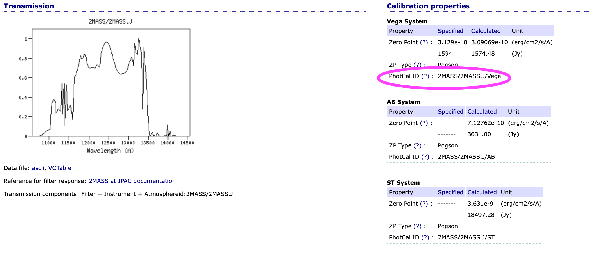

***************************************************
MIVOT (``pyvo.mivot``): How to annotate data - Tips
***************************************************

The annotation process is intended to be performed at the server level.
How it is implemented depends on the related DAL protocol, the framework used,
and the available metadata.
This process likely occurs before the data table is streamed out because
the Mivot block must precede the TABLE block.
This means it cannot use the table FIELDs, but rather some internal representation.

However, the examples below use the FIELDs to demonstrate how an annotation task could work.

Map a magnitude to a Mango Brightness property
==============================================

Assuming that our dataset has the two following fields, let's map the magnitude in the J band
to the ``mango:Brightness`` class.

 .. code-block:: xml
 
    <FIELD name="Jmag" ucd="phot.mag;em.IR.J" datatype="float" width="6" precision="3" unit="mag">
      <DESCRIPTION>?(jmag) 2MASS J-band magnitude</DESCRIPTION>
    </FIELD>
    <FIELD name="e_Jmag" ucd="stat.error;phot.mag" datatype="float" width="6" precision="3" unit="mag">
      <DESCRIPTION>?(ejmag) Error on Jmag</DESCRIPTION>
    </FIELD>
 
The MANGO brightness class packs together 3 components: the magnitude, its error and the photometric calibration.
 
Mivot serializations of the photometric calibrations are given by the SVO `Filter Profile Service <https://svo2.cab.inta-csic.es/svo/theory/fps/>`_.
The first thing to do is to get the FPS identifier of the searched filter (2MASS J in our case).

Once the filter is selected, the identifier of the calibration in the desired system can by copied from the 
`FPS <https://svo2.cab.inta-csic.es/svo/theory/fps/index.php?id=2MASS/2MASS.J&&mode=browse&gname=2MASS&gname2=2MASS#filter>`_
page as shown below.  

Now, we can build the mapping parameters and apply them to add the mapping of that property.

 .. code-block:: python
 
    votable = parse("SOME/VOTABLE/PATH")
    builder = InstancesFromModels(votable, dmid="URAT1")

    # Add the mapping of a brightness property
    builder.add_mango_brightness( photcal_id="2MASS/2MASS.J/Vega",
            mapping={"value": "Jmag",
                     "error": { "class": "PErrorSym1D", "sigma": "e_Jmag"}
                     },
            semantics={"description": "magnitude J",
                       "uri": "https://www.ivoa.net/rdf/uat/2024-06-25/uat.html#magnitude",
                       "label": "magnitude"})

    
    # Once all all properties have been mapped, we can
    # tell the builder to complete the mapping block    
    builder.pack_into_votable()

The mapping parameters can be interpreted that way:
 
 - The photometric calibration match the ``2MASS/2MASS.J/Vega`` FPS output
 - The magnitude is given by the FIELD identified by  ``Jmag``
 - The magnitude error, which is symmetrical, is given by the FIELD identified by  ``e_Jmag``
 - The optional semantics block of the property (see the MANGO specification) indicates that the
   property is a magnitude.
 

Map table data to a Mango EpochPosition property
================================================

The mapping of any property follow the same schema but with specific mapping parameters.
As it turns out, the EpochPosition can be very complex, with six parameters, their errors and their correlations.

If the VOTable fields are available during the annotation process, the API can extract a template of the mapping parameters.

 .. code-block:: python
 
    scs_srv = SCSService(" https://vizier.cds.unistra.fr/viz-bin/conesearch/V1.5/I/239/hip_main")

    query_result = scs_srv.search(
        pos=SkyCoord(ra=52.26708 * u.degree, dec=59.94027 * u.degree, frame='icrs'),
        radius=0.5)

    builder = InstancesFromModels(query_result.votable, dmid="URAT1")
    
    # Get a mapping proposal based on the FIELD UCDs
    parameters = builder.extract_epoch_position_parameters()
    DictUtils.print_pretty_json(parameters)

The JSON below shows the detected mapping parameters as a dictionary whose structure matches that expected by the API.
  
 .. code-block:: json
 
	 {
	  "frames": {
	    "spaceSys": {
	      "dmid": "_spaceframe_ICRS_BARYCENTER"
	    },
	    "timeSys": {}
	  },
	  "mapping": {
	    "longitude": "t1_c8",
	    "latitude": "t1_c9",
	    "parallax": "t1_c11",
	    "pmLongitude": "t1_c12",
	    "pmLatitude": "t1_c13",
	    "errors": {
	      "properMotion": {
	        "class": "PErrorSym2D",
	        "sigma1": "e_pmRA",
	        "sigma2": "e_pmDE"
	      }
	    },
	    "correlations": {}
	  },
	  "semantics": {
	    "description": "6 parameters position",
	    "uri": "https://www.ivoa.net/rdf/uat/2024-06-25/uat.html#astronomical-location",
	    "label": "Astronomical location"
	  }
	}
 
This template can be updated manually or by any other means, and then used to adjust the "EpochPosition" mapping.
 
 .. code-block:: python
    
    # Add the EpochPosition to the annotations with the modified mapping parameters
    builder.add_mango_epoch_position(**parameters)
    builder.pack_into_votable()

