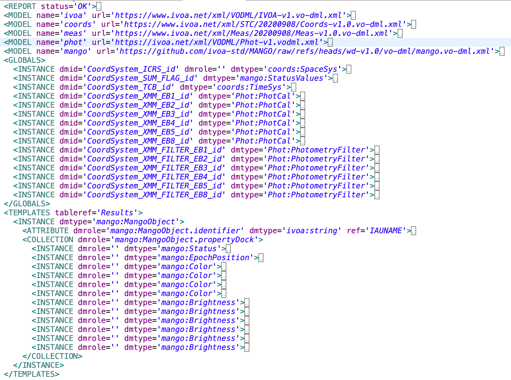

************************************************************
MIVOT (``pyvo.mivot``): How to use annotated data - Examples
************************************************************

Photometric properties readout
==============================

This example is based on VOTables provided by the ``XTapDB`` service.
This service exposes the slim `4XMM dr14 catalogue <http://xmmssc.irap.omp.eu/>`_.
It  is able to map query responses on the fly to the MANGO data model.
The annotation process only annotates the columns that are selected by the query.

The following properties are supported:

- ``mango:Brightness`` to which fluxes are mapped
- ``mango:Color`` to which hardness ratio are mapped
- ``mango:EpochPosition`` to which positions and first observation  dates are mapped
- ``mango:Status`` to which quality flags of the source detections are mapped

A specific response format (``application/x-votable+xml;content=mivot``) must be set in order
to tell the server to annotate the queried data.

(*Please read the comment inside the code snippet carefully to fully understand the process*)

 .. code-block:: python

    import pytest
    from pyvo.utils import activate_features
    from pyvo.dal import TAPService
    from pyvo.mivot.utils.xml_utils import XmlUtils
    from pyvo.mivot.utils.dict_utils import DictUtils
    from pyvo.mivot.viewer.mivot_viewer import MivotViewer

    # Enable MIVOT-specific features in the pyvo library
    activate_features("MIVOT")

    service = TAPService('https://xcatdb.unistra.fr/xtapdb')
    result = service.run_sync(
        """
        SELECT TOP 5 * FROM "public".mergedentry
        """,
        format="application/x-votable+xml;content=mivot"
        )

    # The MIVOT viewer generates the model view of the data
    m_viewer = MivotViewer(result, resolve_ref=True)

    # Print out the Mivot annotations read out of the VOtable
    # This statement is just for a pedagogic purpose (access to a private attribute)
    XmlUtils.pretty_print(m_viewer._mapping_block)

In this first step we just queried the service and we built the object that will process the Mivot annotations.
The Mivot block printing output is too long to be listed here. However, the screenshot below shows its shallow structure.

- The GLOBALS section contains all the coordinate systems (in a wide sense). This includes the allowed values for
  the detection flags and the photometric calibrations.
- The TEMPLATES section contains the objects to which table data is mapped. In this example, there is one
  ``MangoObject`` instance which holds all the mapped properties.

At instantiation time, the viewer reads the first data row, which must exist,
in order to construct a Python object that reflects the mapped model.

 .. code-block:: python

    # Build a Python object matching the TEMPLATES content and
    # which leaves are set with the values of the first row
    mango_object = m_viewer.dm_instance

    # Print out the content of the Python object
    # This statement is just for a pedagogic purpose
    DictUtils.print_pretty_json(mango_object.to_dict())

The annotations are consumed by this dynamic Python object which leaves are set with the data of the current row.
You can explore the structure of this object by using the printed dictionary or standard object paths as shown below.

Now, we can iterate through the table data and retrieve an updated Mivot instance for each row.

 .. code-block:: python

    while m_viewer.next_row_view():
        if mango_object.dmtype == "mango:MangoObject":
            print(f"Read source {mango_object.identifier.value} {mango_object.dmtype}")
            for mango_property in mango_object.propertyDock:
                if  mango_property.dmtype == "mango:Brightness":
                    if mango_property.value.value:
                        mag_value = mango_property.value.value
                        mag_error = mango_property.error.sigma.value
                        phot_cal = mango_property.photCal
                        spectral_location = phot_cal.photometryFilter.spectralLocation
                        mag_filter = phot_cal.identifier.value
                        spectral_location = phot_cal.photometryFilter.spectralLocation
                        mag_wl = spectral_location.value.value
                        sunit = spectral_location.unitexpression.value

                        print(f"  flux at {mag_wl} {sunit} (filter {mag_filter}) is {mag_value:.2e} +/- {mag_error:.2e}")

    Read source 4XMM J054329.3-682106 mango:MangoObject
      flux at 0.35 keV (filter XMM/EPIC/EB1) is 8.35e-14 +/- 3.15e-14
      flux at 0.75 keV (filter XMM/EPIC/EB2) is 3.26e-15 +/- 5.45e-15
      flux at 6.1 keV (filter XMM/EPIC/EB8) is 8.68e-14 +/- 6.64e-14
    ...
    ...

The same code can easily be connected with matplotlib to plot SEDs as shown below (code not provided).

.. image:: _images/xtapdbSED.png
   :width: 500
   :alt: XMM SED

It is to noted that the current table row keeps available through the Mivot viewer.

 .. code-block:: python

    row = m_viewer.table_row

.. important::
   The code shown in this example can be used with any VOTable that has data mapped to MANGO.
   It contains no features specific to the XtatDB output.

   This is exactly the purpose of the MIVOT/MANGO abstraction layer: to allow the same processing
   to be applied to any annotated VOTable.

   The same client code can be reused in many places with many datasets, provided they are annotated.

EpochPosition property readout
==============================

This example is based on a VOtable resulting on a Vizier cone search.
This service maps the data to  the ``EpochPosition`` MANGO property,
which models a full source's  astrometry at a given date.

.. warning::
   At the time of writing, Vizier only mapped positions and proper motions (when  available),
   and the definitive epoch class had not been adopted.
   Therefore, this implementation may differ a little bit from the standard model.

   Vizier does not wrap the source properties in a MANGO object,
   but rather lists them in the Mivot *TEMPLATES*.
   The annotation reader must support both designs.

In the first step below, we run a standard cone search query by using the standard PyVO API.

 .. code-block:: python

    import pytest
    import astropy.units as u
    from astropy.coordinates import SkyCoord
    from pyvo.dal.scs import SCSService

    from pyvo.utils import activate_features
    from pyvo.mivot.viewer.mivot_viewer import MivotViewer
    from pyvo.mivot.features.sky_coord_builder import SkyCoordBuilder
    from pyvo.mivot.utils.dict_utils import DictUtils

    # Enable MIVOT-specific features in the pyvo library
    activate_features("MIVOT")

    scs_srv = SCSService("https://vizier.cds.unistra.fr/viz-bin/conesearch/V1.5/I/239/hip_main")

    query_result = scs_srv.search(
        pos=SkyCoord(ra=52.26708 * u.degree, dec=59.94027 * u.degree, frame='icrs'),
        radius=0.5)

    # The MIVOt viewer generates the model view of the data
    m_viewer = MivotViewer(query_result, resolve_ref=True)

Once the query is finished, we can get a reference to the object that will process the Mivot annotations.

 .. code-block:: python

    # Build a Python object matching the TEMPLATES content and
    # which leaves are set with the values of the first row
    mango_property = m_viewer.dm_instance

    # Print out the content of the Python object
    # This statement is just for a pedagogic purpose
    DictUtils.print_pretty_json(mango_property.to_dict())

The annotations are consumed by this dynamic Python object which leaves are set with the data of the current row.
You can explore the structure of this object by using standard object paths or by browsing the dictionary shown below.

 .. code-block:: json

	{
	  "dmtype": "mango:EpochPosition",
	  "longitude": {
	    "dmtype": "ivoa:RealQuantity",
	    "value": 51.64272638,
	    "unit": "deg"
	  },
	  "latitude": {
	    "dmtype": "ivoa:RealQuantity",
	    "value": 60.28156089,
	    "unit": "deg"
	  },
	  "pmLongitude": {
	    "dmtype": "ivoa:RealQuantity",
	    "value": 13.31,
	    "unit": "mas/yr"
	  },
	  "pmLatitude": {
	    "dmtype": "ivoa:RealQuantity",
	    "value": -23.43,
	    "unit": "mas/yr"
	  },
	  "epoch": {
	    "dmtype": "ivoa:RealQuantity",
	    "value": 1991.25,
	    "unit": "yr"
	  },
	  "parallax": {
	    "dmtype": "ivoa:RealQuantity",
	    "value": 5.12,
	    "unit": "mas"
	  },
	  "spaceSys": {
	    "dmtype": "coords:SpaceSys",
	    "dmid": "SpaceFrame_ICRS",
	    "dmrole": "mango:EpochPosition.spaceSys",
	    "frame": {
	      "dmrole": "coords:PhysicalCoordSys.frame",
	      "dmtype": "coords:SpaceFrame",
	      "spaceRefFrame": {
	        "dmtype": "ivoa:string",
	        "value": "ICRS"
	      }
	    }
	  }
	}

 The reader can transform ``EpochPosition`` instances into ``SkyCoord`` instances.
 These can then be used for further scientific processing.

 .. code-block:: python

    while m_viewer.next_row_view():
       if mango_property.dmtype == "mango:EpochPosition":
           scb = SkyCoordBuilder(mango_property.to_dict())
           # do whatever process with the SkyCoord object
           print(scb.build_sky_coord())

.. important::
   Similar to the previous example, this code can be used with any VOTable with data mapped to MANGO.
   It contains no features specific to the Vizier output.

   It avoids the need for users to build SkyCoord objects by hand from VOTable fields,
   which is never an easy task.

The next section provides some tips to use the API documented in the :ref:`annoter page <mivot-annoter>`.
