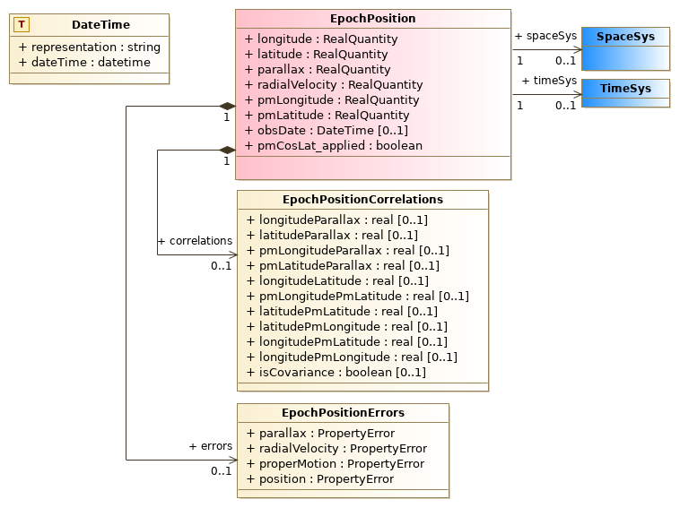

********************
MIVOT (`pyvo.mivot`)
********************

This module contains the new feature of annotations in VOTable.
Astropy version >= 6.0 is required.

Introduction
============
.. pull-quote::

    Model Instances in VOTables (MIVOT) defines a syntax to map VOTable
    data to any model serialized in VO-DML. The annotation operates as a
    bridge between the data and the model. It associates the column/param
    metadata from the VOTable to the data model elements (class, attributes,
    types, etc.) [...].
    The data model elements are grouped in an independent annotation block
    complying with the MIVOT XML syntax. This annotation block is added
    as an extra resource element at the top of the VOTable result resource. The
    MIVOT syntax allows to describe a data structure as a hierarchy of classes.
    It is also able to represent relations and composition between them. It can
    also build up data model objects by aggregating instances from different
    tables of the VOTable.

- Model Instances in VOTables is a VO `standard <https://ivoa.net/documents/MIVOT/20230620/REC-mivot-1.0.pdf>`_
- Requires Astropy>=6.0
- ``pyvo.mivot`` is a prototype feature which must be activated with ``activate_features("MIVOT")``

Implementation Scope
--------------------
This implementation is totally model-agnostic.

- It does not operate any validation against specific data models.
- It just requires the annotation syntax being compliant with the standards.

However, many data samples used for the test suite and provided as examples
are based on the ``EpochPropagation`` class of the ``Mango`` data model
that is still a draft.
This class collects all the parameters we need to compute the epoch propagation of moving sky objects.
Some of the examples have been provided by a special end-point of the Vizier cone-search service
(https://cdsarc.cds.unistra.fr/beta/viz-bin/mivotconesearch) that maps query results to this model.

It is to be noted that the Vizier service does not annotate errors at the time of writing (Q1 2024)

The implementation uses the Astropy read/write annotation module (6.0+),
which allows to get (and set) Mivot blocks from/into VOTables as an XML element serialized as a string.

.. pull-quote::

    Not all MIVOT features are supported by this implementation, which mainly focuses on the
    epoch propagation use case:

    - ``JOIN`` features are not supported.
    - ``TEMPLATES`` with more than one ``INSANCE`` not supported.

Integrated Readout
------------------
The ``ModelViewer`` module manages access to data mapped to a model through dynamically
generated objects (``MivotInstance``class).
The example below shows how a VOTable, resulting from a cone-search query which data are mapped
to the ``EpochPosition`` class, can be consumed.

.. doctest-remote-data::
    >>> import astropy.units as u
    >>> from astropy.coordinates import SkyCoord
    >>> from pyvo.dal.scs import SCSService
    >>> from pyvo.utils.prototype import activate_features
    >>> from pyvo.mivot.version_checker import check_astropy_version
    >>> from pyvo.mivot.viewer.mivot_viewer import MivotViewer
    >>> activate_features("MIVOT")
    >>> if check_astropy_version() is False:
    ...    pytest.skip("MIVOT test skipped because of the astropy version.")
    >>> scs_srv = SCSService("https://cdsarc.cds.unistra.fr/beta/viz-bin/mivotconesearch/I/239/hip_main")
    >>> m_viewer = MivotViewer(
    ...     scs_srv.search(
    ...         pos=SkyCoord(ra=52.26708 * u.degree, dec=59.94027 * u.degree, frame='icrs'),
    ...         radius=0.05
    ...     )
    ... )
    >>> mivot_instance = m_viewer.dm_instance
    >>> print(mivot_instance.dmtype)
    mango:EpochPosition
    >>> print(mivot_instance.coordSys.spaceRefFrame.value)
    ICRS
    >>> while m_viewer.next():
    ...     print(f"position: {mivot_instance.latitude.value} {mivot_instance.longitude.value}")
    position: 59.94033461 52.26722684

In this example, the data readout is totally managed by the ``MivotViewer`` instance.
The ``astropy.io.votable`` API is encapsulated in this module.

Model leaves (class attributes) are complex types that provide additional information:

- ``value``: attribute value
- ``dmtype``: attribute type such as defined in the Mivot annotations
- ``unit``: attribute unit such as defined in the Mivot annotations
- ``ref``: identifier of the table column mapped on the attribute

The model view on a data row can also be passed as a Python dictionary
using the ``to_dict()`` method of ``MivotInstance``. 

.. code-block:: python
    :caption: Working with a model view as a dictionary
              (the JSON layout has been squashed for display purpose)

	from pyvo.mivot import MivotViewer
    from pyvo.mivot.utils.dict_utils import DictUtils
    
    m_viewer = MivotViewer(path_to_votable)
    mivot_instance = m_viewer.dm_instance
    mivot_object_dict = mivot_object.to_dict()

    DictUtils.print_pretty_json(mivot_object_dict)
	{
        "dmtype": "mango:EpochPosition",
        "longitude": {"value": 359.94372764, "unit": "deg"},
        "latitude": {"value": -0.28005255, "unit": "deg"},
        "pmLongitude": {"value": -5.14, "unit": "mas/yr"},
        "pmLatitude": {"value": -25.43, "unit": "mas/yr"},
        "epoch": {"value": 1991.25, "unit": "year"},
        "coordSys": {
            "dmtype": "coords:SpaceSys",
            "dmid": "ICRS",
            "dmrole": "coords:Coordinate.coordSys",
            "spaceRefFrame": {"value": "ICRS"},
        },
    }

- It is recommended to use a copy of the
  dictionary as it will be rebuilt each time the ``to_dict()`` method is invoked.
- The default representation of ``MivotInstance`` instances is made with a pretty
  string serialization of this dictionary (method ``__repr__()``).
- An extended version of the object dictionary e.g. with information about where 
  the values were picked from from, is available  using the method ``to_hk_dict()``.

Per-Row Readout
---------------

The annotation schema can also be applied to table rows read outside of the ``MivotViewer``
with the `astropy.io.votable` API:

.. code-block:: python
    :caption: Accessing the model view of Astropy table rows

    votable = parse(path_to_votable)
    table = votable.resources[0].tables[0]
    # init the viewer
    mivot_viewer = MivotViewer(votable, resource_number=0)
    mivot_object = mivot_viewer.dm_instance
    # and feed it with the table row
    read = []
    for rec in table.array:
        mivot_object.update(rec)
        read.append(mivot_object.longitude.value)
        # show that the model retrieve the correct data values
        assert rec["RAICRS"] == mivot_object.longitude.value
        assert rec["DEICRS"] == mivot_object.latitude.value

In this case, it is up to the user to ensure that the read data rows are those mapped by the Mivot annotations.

Get a SkyCoord Instance Directly From the Annotations
-----------------------------------------------------

Once you get a ``MivotInstance`` representing the last row read, you can use it to create an ``astropy.SkyCoord`` object.

.. code-block:: python
    :caption: Accessing the model view of Astropy table rows

	from pyvo.mivot import MivotViewer
    
    m_viewer = MivotViewer(path_to_votable)
    mivot_instance = m_viewer.dm_instance
    print(mivot_instance.get_SkyCoord())
    <SkyCoord (ICRS): (ra, dec) in deg(52.26722684, 59.94033461)
          (pm_ra_cosdec, pm_dec) in mas / yr(-0.82, -1.85)>

This feature works under the condition that the annotations contain a valid instance of ``mango:EPochPosition``, otherwise
a ``NoMatchingDMTypeError`` is thrown. 
Although not a standard at the time of writing, the class structure supported by this implementation must match the figure above.

For XML Hackers
---------------

The model instances can also be serialized as XML elements that can be parsed with XPath queries.

.. code-block:: python
    :caption: Accessing the XML view of the mapped model instances

    with MivotViewer(path_to_votable) as mivot_viewer:
        while mivot_viewer.next():
        	xml_view = mivot_viewer.xml_view
        	# do whatever you want with this XML element

It to be noted that ``mivot_viewer.xml_view`` is a shortcut
for ``mivot_viewer.xml_view.view`` where ``mivot_viewer.xml_view``
is is an instance of ``pyvo.mivot.viewer.XmlViewer``.
This object provides many functions facilitating the XML parsing.

Class Generation in a Nutshell
------------------------------

MIVOT reconstructs model structures with 3 elements:

- ``INSTANCE`` for the objects
- ``ATTRIBUTE`` for the attributes
- ``COLLECTION`` for the elements with a cardinality greater than 1

The role played by each of these elements in the model hierarchy is defined
by its ``@dmrole`` XML attribute. Types of both ``INSTANCE`` and ``ATTRIBUTE`` are defined by
their ``@dmtype`` XML attributes.

``MivotInstance`` classes are built by following MIVOT annotation structure:

- ``INSTANCE`` are represented by Python classes
- ``ATTRIBUTE`` are represented by Python class fields
- ``COLLECTION`` are represented by Python lists ([])

``@dmrole`` and ``@dmtype`` cannot be used as Python keywords as such, because they are built from VO-DML
identifiers, which have the following structure: ``model:a.b``.

- Only the last part of the path is kept for attribute names.
- For class names, forbidden characters (``:`` or ``.``) are replaced with ``_``.
- Original ``@dmtype`` are kept as attributes of generated Python objects.
- The structure of the ``MivotInstance`` objects can be inferred from the mapped model in 2 different ways:

  - 1.  From the MIVOT instance property ``MivotInstance.to_dict()`` a shown above.
        This is a pure Python dictionary but its access can be slow because it is generated
        on the fly each time the property is invoked.
  - 2.  From the internal  class dictionary ``MivotInstance.__dict__``
        (see the Python `data model <https://docs.python.org/3/reference/datamodel.html>`_).

Reference/API
=============

.. automodapi:: pyvo.mivot
.. automodapi:: pyvo.mivot.viewer
.. automodapi:: pyvo.mivot.seekers
.. automodapi:: pyvo.mivot.features
.. automodapi:: pyvo.mivot.utils
